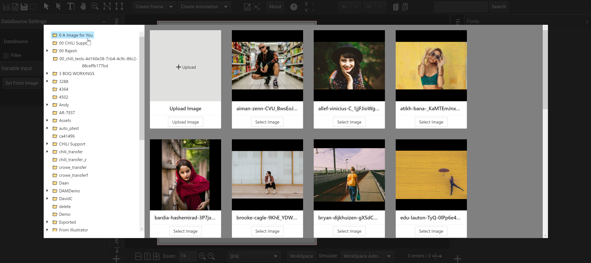

# Asset Browser Demo

[chili-custom-asset-browser-demo](https://github.com/seancrowe/chili-custom-asset-browser-demo) is a demo of a custom asset browser. It is not production ready, but it is a good example of using our JavaScript API to interact with CHILI.

## 🤔 Who Is This For
This demo was created specifically for a client to show how JavaScript could be integrated into documents to create custom UI elements. Generically, this project can be seen as a learning tool for all users of CHILI publisher to learn how to integrate with the editor.

This is **not** a production ready project. It is a demo, POC, example, a learning tool. This was built fast and dirty, so there has been very little to no refactoring done to make the code cleaner, simple, and error free (although there should be no major errors if ran in a similar test environment).

For example, I built this project in React, but in this scenario, using React for one UI element is a bit too heavy. What you would really want to do is build this in native JavaScript. However, being a demo, using React allowed me to easily implement pre-made components from [Ant Design](https://ant.design/). This saved me lots of time at the cost of 600+ KB of file size.

Another example is that styling is added in three different ways: via a style sheet, inline, and through styled-components. This should be combined into one way, not three.

Again, this is a tech demo that was done under time constraints. Thus, you will find some common sense features missing. For example, there is no close button. To close the custom asset browser, you must select an image. If you choose not to select an image, there is no other way to close the asset browser except using the console to call the global function ``window.launchCustomAssetBrowser("")``.

## 🛠 Project Support
It may be obvious, but in case it is not, support for this project will be limited. While there may be minor updates, especially ones reported around bugs. I consider this project to be done. If you would like to see new features, then please feel free to fork and either privately add them or make a pull request.

If you find a bug, please open up an issue on the GitHub page: [chili-custom-asset-browser-demo](https://github.com/seancrowe/chili-custom-asset-browser-demo). You can make a feature request. I cannot stop you, but expect it to not be picked up.

Some bugs may be related to the integration or certain behaviors in CHILI. For example, the call ResourceGetTreeLevel will typically cause issues when requested on folder paths that have a large number of files. These type of bugs or issues are outside my interest to support even if techniques could be used to mitigate the problem.

In addition, this project was built to work with CHILI publish Online (as of 2021) in a native Editor with no modifications. Trying to run this on an older version of CHILI could cause unforeseen issues. Trying to run this within an integration may cause issues. In both cases, you may need to modify the code to work in your scenario.

## 🥏 How To Use This Project
You are meant to follow the below steps while testing in the BackOffice.

*The documentation assumes you have experience with CHILI publisher.*

#### Section 1: Testing
- [1.1 Create Your Document](https://seancrowe.github.io/chili-custom-asset-browser-demo/testing/create_your_document.md)
- [1.2 Add The JavaScript](https://seancrowe.github.io/chili-custom-asset-browser-demo/testing/add_the_javascript.md)
- [1.3 Launch The Customer Browser](https://seancrowe.github.io/chili-custom-asset-browser-demo/testing/launch_the_customer_browser.md)
  
#### Section 2: The Code
- [2.1 The Importance of index.js](https://seancrowe.github.io/chili-custom-asset-browser-demo/thecode/the_importance_of_index.md)
- [2.2 Looking at App.jsx](https://seancrowe.github.io/chili-custom-asset-browser-demo/thecode/looking_at_app.md)
- [2.3 Understanding FileBrowser Component](https://seancrowe.github.io/chili-custom-asset-browser-demo/thecode/understanding_fileBrowser_component.md)
- [2.4 Understanding AssetViewer Component](https://seancrowe.github.io/chili-custom-asset-browser-demo/thecode/understanding_assetviewer_component.md)
- [2.5 Building For Use](https://seancrowe.github.io/chili-custom-asset-browser-demo/thecode/building_for_use.md)